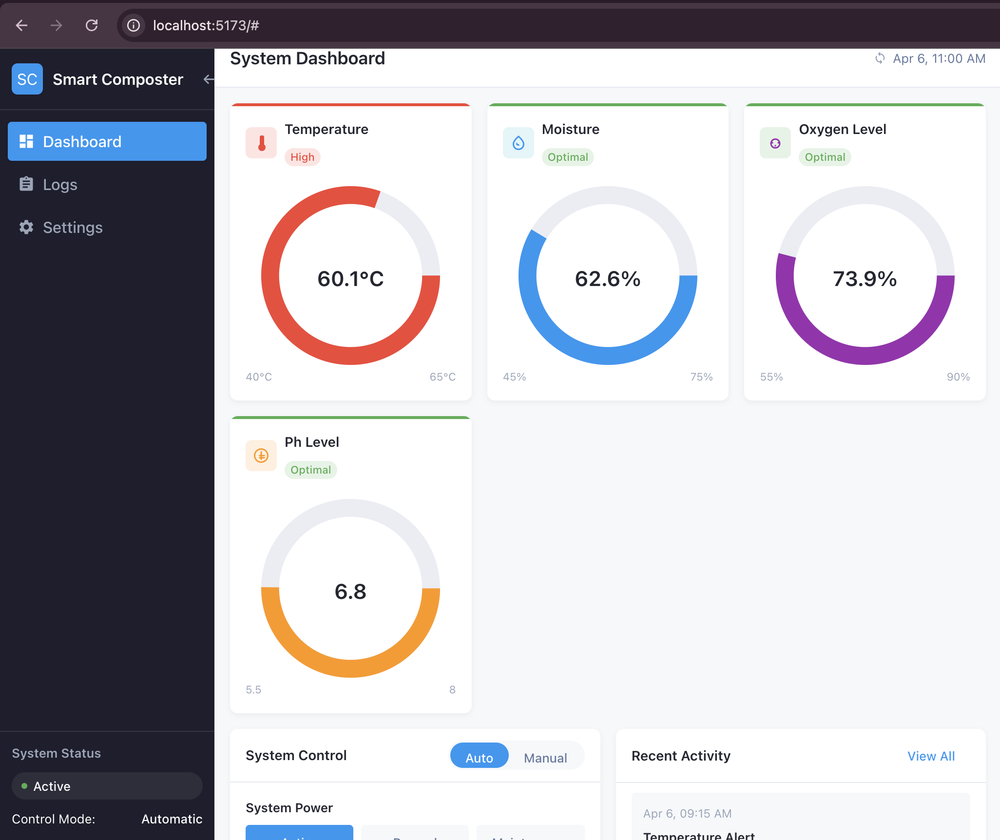
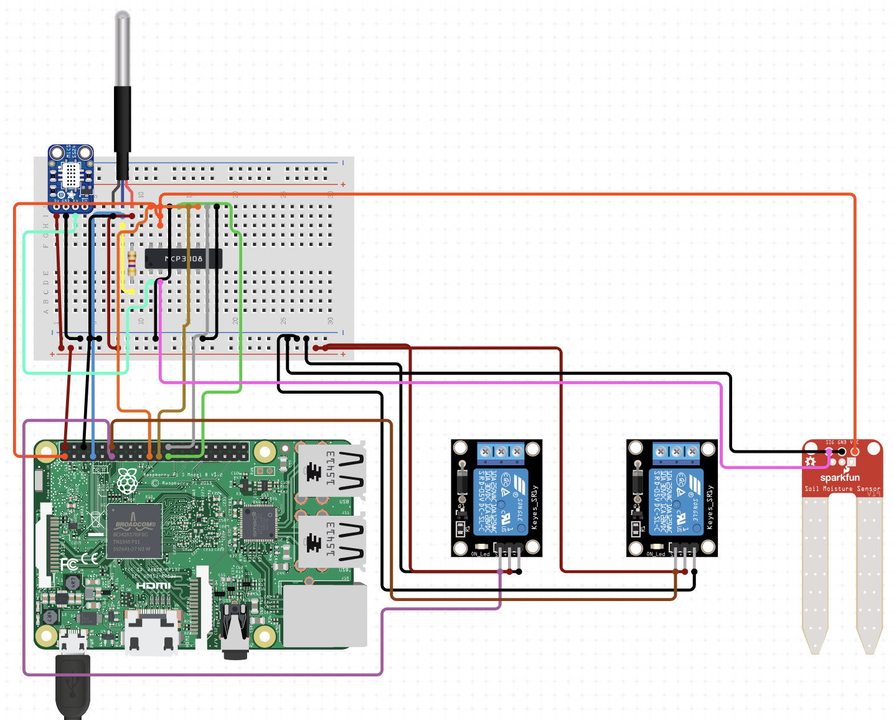

# Smart Composter

An IoT-based compost monitoring and control system powered by Raspberry Pi with automated controls for temperature, moisture, oxygen, and pH management.



## Overview

This project implements an intelligent composting system that uses sensor data to optimize the composting process through automated controls. The system monitors key parameters (temperature, moisture, oxygen levels, and pH) and automatically adjusts conditions by controlling mixer and aeration systems.

## Hardware Schematic



## Technology Stack

- **Frontend**: React, TypeScript (App.tsx, App.css)
- **Backend**: Python, Flask
- **Hardware**: Raspberry Pi, temperature sensor (DS18B20), moisture sensor, oxygen sensor (MICS5524), pH sensor
- **Communication**: HTTP/REST API for frontend-backend integration

## Features

- **Real-time sensor monitoring** for temperature, moisture, oxygen, and pH
- **Automatic control system** that maintains optimal composting conditions
- **Manual override** capabilities for direct control of mixers and aeration
- **Comprehensive logging** of all system events and actions
- **Adjustable thresholds** for all monitored parameters
- **Responsive web interface** accessible from any device
- **System status tracking** with active, paused, and maintenance modes

## Getting Started

### Prerequisites

1. Raspberry Pi (3B+ or 4 recommended)
2. Sensors:
   - DS18B20 temperature sensor
   - Capacitive soil moisture sensor
   - MICS5524 oxygen sensor
   - pH sensor module
3. Relay module (2-channel minimum)
4. Compost mixer motor
5. Aeration system/pump
6. Jumper wires and breadboard

### Hardware Setup

1. Connect the hardware according to the schematic diagram above
2. Verify GPIO pin connections:
   - DS18B20 temperature sensor: GPIO 4
   - MCP3008 ADC chip select: GPIO 8
   - MICS5524 oxygen sensor: ADC channel 0
   - Soil moisture sensor: ADC channel 1
   - pH sensor: ADC channel 2
   - Mixer relay: GPIO 17
   - Aeration relay: GPIO 18

### Software Installation

#### 1. Clone the Repository

```bash
git clone https://github.com/yourusername/smart-composter.git
cd smart-composter
```

#### 2. Set up Environment Files

Create backend environment file:

```bash
cd backend
touch .env
```

Add the following to `.env`:

```
# Raspberry Pi Smart Composter - Backend Environment
PORT=5000
HOST=0.0.0.0
DEBUG=True
SIMULATION_MODE=False

# Hardware settings
TEMP_PIN=4
ADC_CS_PIN=8
MOISTURE_CHANNEL=1
OXYGEN_CHANNEL=0
PH_CHANNEL=2
MIXER_PIN=17
AERATION_PIN=18

# Database settings
DB_PATH=./data/compost_data.db

# Logging settings
LOG_LEVEL=INFO
SENSOR_LOG_INTERVAL=300
```

#### 3. Install Backend Dependencies

```bash
cd backend
pip install -r requirements.txt
```

This installs:
- Flask and Flask-CORS for the API server
- RPi.GPIO for hardware interfacing
- Python libraries for sensor communication
- Other utility packages

#### 4. Install UI Dependencies

```bash
npm install
```

### Verify Hardware Connections

Before running the full application, verify your sensor connections:

```bash
cd backend
python hardware_test.py
```

This will test each sensor and actuator and display readings to confirm everything is properly connected.

### Running the Application

#### 1. Start the Backend Server

```bash
cd backend
python app.py
```

This will start the Flask server on port 5000.

#### 2. Start the Development Server

```bash
npm run dev
```

Visit `http://localhost:5173` to access the UI.

#### 3. Build for Production

```bash
npm run build
```

This creates optimized production files in the `dist` directory.

### Setting Up as a System Service

For the system to run on boot, create a systemd service:

```bash
sudo nano /etc/systemd/system/smart-composter.service
```

Add the following:

```
[Unit]
Description=Smart Composter Monitoring System
After=network.target

[Service]
User=pi
WorkingDirectory=/home/pi/smart-composter/backend
ExecStart=/usr/bin/python3 app.py
Restart=always
RestartSec=5

[Install]
WantedBy=multi-user.target
```

Enable and start the service:

```bash
sudo systemctl enable smart-composter.service
sudo systemctl start smart-composter.service
```

## Usage

1. Access the dashboard at http://your-raspberry-pi-ip:5000
2. Monitor real-time sensor data on the dashboard
3. Toggle between Automatic and Manual mode as needed
4. Adjust settings for optimal composting conditions

## Troubleshooting

- **Sensor readings show errors**: Check wiring connections and verify power supply
- **Actuators not responding**: Check relay connections and GPIO pins
- **Web interface unreachable**: Verify network connectivity and that the server is running
- **System crashing**: Check logs at `/var/log/syslog` for errors

## License

This project is licensed under the MIT License - see the LICENSE file for details.

## Acknowledgments

- Built with React and Flask
- Sensor libraries from Adafruit
- Inspiration from open-source composting projects